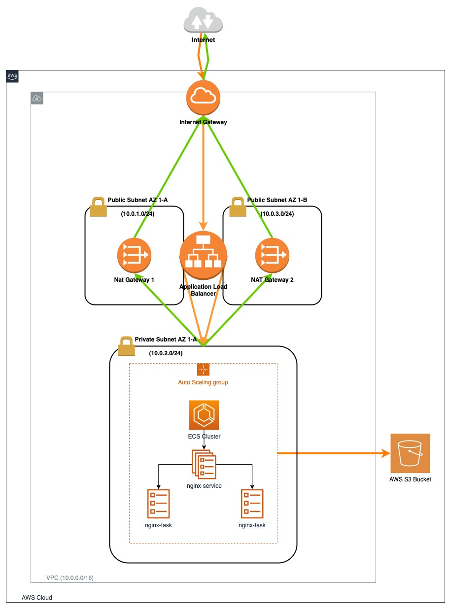

# Author: Okan Menevşeoğlu

You can find my CV online <a href="https://okanmenevseoglu.github.io">here</a>.

I also write blog posts on Medium from time to time. If you are interested, you can have a
look <a href="https://medium.com/@okanmenevseoglu">here</a>.

# Terraform ECS Cluster

This is a Terraform project that is developed for experimenting with Terraform on AWS.

The project is very straightforward. You can refer to the diagram to see what is implemented. The files are also named
according to tasks they do with additional comments inside.



## 1. How to run?

To be able to run the project; ```AWS_ACCESS_KEY``` and ```AWS_SECRET_KEY``` need to be defined either
in ```terraform.tfvars``` or when ```terraform apply``` is run.

After defining the above variables, you can run;

1. ```terraform init``` to prepare the current working directory for use with Terraform.
2. After initializing the project, you can simply run ```terraform plan``` to see the execution plan.
3. Finally, you can run ```terraform apply``` and type ```yes``` when prompted.
4. If you want to destroy the resources created, you can run ```terraform destroy``` and type ```yes``` when prompted.

## 2. Output

The project prints out the public DNS that is used by the Application Load Balancer. You can copy that link and paste it
in the browser to access the NGINX resource that is created.

## 3. Project Notes

- There are```2 parallel tasks```. Thus, I have enabled ```containerPort: 0``` to be able to
  use ```dynamic port mapping```and run multiple tasks with ease.

- Also, there is a private S3 bucket and necessary IAM roles to write object to the S3 bucket. However, there are no
  writes at the moment. I assumed that it would be for the future use.